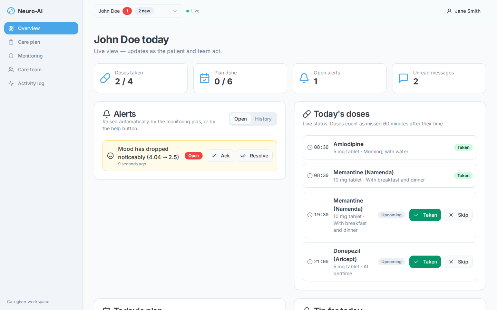
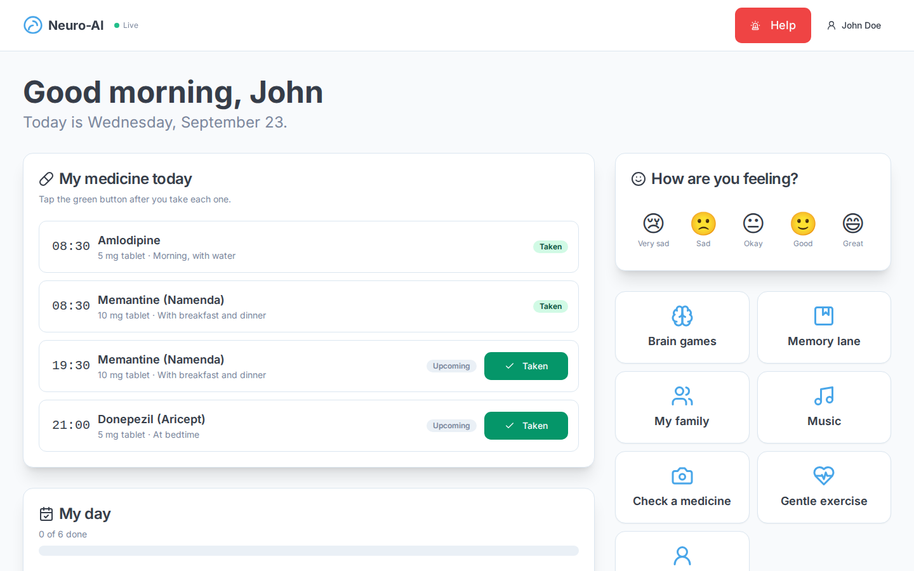
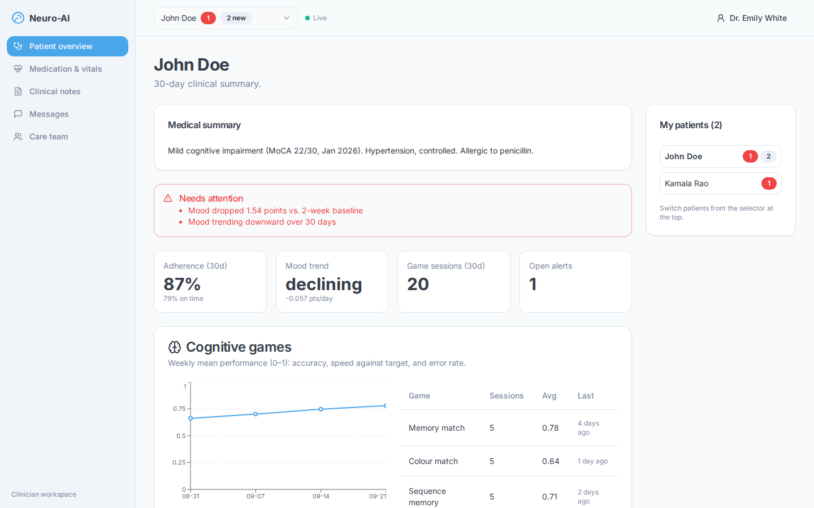

# Neuro-AI

[](https://github.com/jay7-tech/Neuro.ai/actions/workflows/ci.yml)

A care-coordination platform for people living with dementia. The patient, their family caregivers and their doctor share one live view of medication, daily routine, mood and safety, and each of them gets an interface built for their role.



| Patient                                            | Clinician                                                      |
| -------------------------------------------------- | -------------------------------------------------------------- |
|  |  |

## What it does

**Patients** get a calm, large-type home screen:

- today's medicine, with a one-tap "Taken" button
- a daily checklist and a mood check-in
- a companion that answers "what's my son's name?" from their own records
- reminiscence tools: memory lane, family gallery and music
- four adaptive brain games
- a camera check that tells them whether a tablet pack matches their prescriptions
- a Help button that is always visible

**Caregivers**:

- manage medication schedules, routines and reminiscence content
- get live alerts for missed doses, wandering outside a safe zone, mood decline and SOS presses
- invite family members and doctors with single-use codes
- see a full audit trail of every change

**Clinicians**:

- get a 30-day summary with automatic risk flags (adherence below 80 %, a mood drop against the patient's own baseline, declining game performance)
- adjust prescriptions and write clinical notes that the care team can read

## Engineering highlights

| Area                    | What was built                                                                                                                                                                                                                                               | Where                                                                                                              |
| ----------------------- | ------------------------------------------------------------------------------------------------------------------------------------------------------------------------------------------------------------------------------------------------------------ | ------------------------------------------------------------------------------------------------------------------ |
| **Authorization**       | Access depends on the role a user holds on each patient's care team, not on their account type. Every rule lives in one pure policy module that has its own unit tests. Users who aren't on the team get `404`, so they can't probe which patient IDs exist. | [`authz/policy.ts`](src/server/authz/policy.ts), [`services/access.ts`](src/server/services/access.ts)             |
| **Sessions**            | Server-side sessions with sliding expiry. The cookie holds a 256-bit token and the database stores only its SHA-256 hash. Login takes the same time whether or not the email exists. Mutating requests are checked for CSRF.                                 | [`auth/session.ts`](src/server/auth/session.ts), [`http/handler.ts`](src/server/http/handler.ts)                   |
| **Adherence engine**    | Expands recurring schedules, written in the patient's local time, into UTC instants (DST-safe). It then joins them with recorded doses to work out each dose's state (due, late or missed, with a grace window), plus streaks and adherence rates.           | [`domain/schedule.ts`](src/server/domain/schedule.ts), [`domain/adherence.ts`](src/server/domain/adherence.ts)     |
| **Mood analytics**      | Compares the patient against their own baseline using a z-score, so a naturally low baseline doesn't trigger alerts. Trend comes from a least-squares slope.                                                                                                 | [`domain/mood.ts`](src/server/domain/mood.ts)                                                                      |
| **Geofencing**          | Haversine distance. A reading only counts as "outside" when its GPS error circle is entirely outside the fence, and an alert needs two such readings in a row. The alert resolves itself when the patient returns.                                           | [`domain/geo.ts`](src/server/domain/geo.ts), [`services/location.ts`](src/server/services/location.ts)             |
| **Realtime**            | Changes publish events through Postgres `LISTEN/NOTIFY` inside the same transaction, so rolled-back work is never broadcast. Each instance fans events out over Server-Sent Events, and clients refresh only the affected queries.                           | [`realtime/bus.ts`](src/server/realtime/bus.ts), [`use-patient-events.ts`](src/hooks/use-patient-events.ts)        |
| **Background jobs**     | A separate worker process runs missed-dose and mood-decline scans. Postgres advisory locks make sure only one replica runs each job per tick, and re-running a job has no extra effect.                                                                      | [`jobs/runner.ts`](src/server/jobs/runner.ts), [`jobs/jobs.ts`](src/server/jobs/jobs.ts)                           |
| **Idempotency & races** | Unique indexes plus `ON CONFLICT` for dose slots. A partial unique index removes duplicate open alerts. Invite redemption uses `SELECT … FOR UPDATE`, and a test fires two redemptions at once to prove only one succeeds.                                   | [`db/schema.ts`](src/server/db/schema.ts), [`services/team.ts`](src/server/services/team.ts)                       |
| **Grounded AI**         | The Gemini companion sees only a JSON of verified facts about the patient. If the LLM is unavailable, a deterministic answerer takes over. Game difficulty is set by a rule-based policy, not an LLM ([ADR-005](docs/adr/005-deterministic-difficulty.md)).  | [`domain/companion.ts`](src/server/domain/companion.ts), [`domain/difficulty.ts`](src/server/domain/difficulty.ts) |
| **End-to-end types**    | One set of Zod schemas validates requests, generates the OpenAPI document and powers client forms. Client response types are derived from service return types, so changing a response shape breaks the client build.                                        | [`lib/contracts.ts`](src/lib/contracts.ts), [`lib/api-types.ts`](src/lib/api-types.ts)                             |
| **Operations**          | Structured logs with request IDs, a health endpoint that also reports background-job status, an append-only audit log written in the same transaction as each change, rate limiting, Docker images and CI.                                                   | [`api/health`](src/app/api/health/route.ts), [`services/audit.ts`](src/server/services/audit.ts)                   |

More detail is in [docs/ARCHITECTURE.md](docs/ARCHITECTURE.md) and the [decision records](docs/adr).

## Tech stack

**Frontend:** Next.js 15 (App Router), React 18, TypeScript (strict), Tailwind CSS, shadcn/ui, TanStack Query, React Hook Form, Recharts

**Backend:** Next.js route handlers, PostgreSQL 16, Drizzle ORM (SQL migrations), Zod, Pino, bcrypt

**AI:** Google Genkit with Gemini 2.5 Flash. Without an API key, the companion and caregiver tips fall back to deterministic answers, and the medicine photo check reports that it is unavailable.

**Quality:** Vitest (unit tests plus integration tests against real Postgres), Playwright end-to-end tests, ESLint, Prettier

**Delivery:** multi-stage Docker images (web and worker), Docker Compose, GitHub Actions, Dependabot

## Getting started

### Option A — Docker (everything in one command)

```bash
docker compose up --build                     # Postgres, migrations, web, worker
docker compose --profile demo run --rm seed   # optional: demo data
```

Open http://localhost:3000.

### Option B — Local development

You need Node 20.11+ and PostgreSQL 16. The easiest way to get Postgres is `docker compose up db`.

```bash
npm install
cp .env.example .env         # used by scripts and the worker
cp .env.example .env.local   # used by Next.js
npm run db:migrate
npm run db:seed              # demo accounts and three weeks of history
npm run dev                  # http://localhost:9002
npm run dev:worker           # in a second terminal: background jobs
```

### Demo accounts

All demo accounts use the password `neuro-demo-2026`.

| Role      | Email               | Try this                                                                              |
| --------- | ------------------- | ------------------------------------------------------------------------------------- |
| Patient   | john@demo.neuro.ai  | Ask the companion "what is my son's name?", play a game, press Help                   |
| Caregiver | jane@demo.neuro.ai  | Monitoring → "Test the alert" to simulate wandering; add a medication                 |
| Clinician | emily@demo.neuro.ai | Review the risk flags, then write a note. Log in as Jane in another window to see it. |

Tip: log in as John and Jane in two different browsers. Messages, doses and alerts show up on the other screen without a refresh.

## Testing

```bash
npm test                 # unit + integration (needs Postgres; uses the neuro_test database)
npm run test:coverage
npm run test:e2e         # Playwright, against a running seeded app
npm run ci               # typecheck, lint, tests and build, exactly as CI runs them
```

- **Unit tests** cover the domain logic: timezone and DST handling, schedule expansion, adherence states and streaks, mood statistics, the difficulty policy, geofencing, fuzzy medicine matching, the authorization matrix and the rate limiter.
- **Integration tests** run the services and HTTP handlers against real Postgres. They cover access control, invite races, idempotent dose recording, the missed-dose job, alert de-duplication, geofence auto-resolution, keyset pagination, advisory-lock exclusivity, `NOTIFY` delivery only after commit, CSRF and rate limiting.
- **End-to-end tests** cover role routing, the patient flow, a realtime message from patient to caregiver, and a clinical note handed from clinician to caregiver.

## API

The REST API is versioned under `/api/v1`. Every response uses the same envelope: `{ data }` on success, or `{ error: { code, message, details, requestId } }` on failure.

An interactive reference, generated from the same Zod schemas the server validates with, is served at **`/api-docs`**. The raw OpenAPI 3.1 document is at `/api/v1/openapi.json`.

## Project structure

```
src/
  app/                  Next.js routes: pages per role + /api/v1 route handlers
  components/
    app/                shells, navigation, providers
    features/           feature components (doses, plan, chat, alerts, games, …)
    ui/                 shadcn/ui primitives
  hooks/api/            TanStack Query hooks, one per endpoint
  lib/contracts.ts      Zod schemas shared by client and server
  server/
    domain/             pure business logic — no I/O, fully unit-tested
    services/           use-cases: authorization, transactions, audit, events
    auth/ authz/        sessions and the permission policy
    ai/                 Genkit flows (companion, medicine check, tips)
    http/               request pipeline, rate limiting, OpenAPI
    realtime/           LISTEN/NOTIFY bus
    jobs/               background jobs and the advisory-lock runner
    db/                 Drizzle schema, migrations, seed
  worker/               background worker entry point
tests/{unit,integration,e2e}
drizzle/                generated SQL migrations
```

## Configuration

| Variable                | Default                 | Purpose                                                           |
| ----------------------- | ----------------------- | ----------------------------------------------------------------- |
| `DATABASE_URL`          | —                       | PostgreSQL connection string (required)                           |
| `APP_URL`               | `http://localhost:9002` | Public origin, used for the CSRF origin check                     |
| `GEMINI_API_KEY`        | _(unset)_               | Turns on LLM answers and medicine photo recognition               |
| `SESSION_TTL_DAYS`      | `30`                    | Session lifetime (sliding)                                        |
| `DOSE_GRACE_MINUTES`    | `60`                    | How long after the scheduled time a dose counts as late or missed |
| `LOG_LEVEL`             | `info`                  | Pino log level                                                    |
| `RATE_LIMIT_MULTIPLIER` | `1`                     | Scales all rate limits (raise for load or e2e tests only)         |

## Known limitations

- The rate limiter keeps its counts in memory, so each instance limits on its own. The `RateLimitStore` interface is there so it can be swapped for Redis.
- Invites are handed over as codes; the app doesn't send email or SMS. Missed-dose and wandering alerts are in-app only.
- Photos are referenced by URL; there is no file upload or object storage yet.
- This is a portfolio project, not a certified medical device, and has not been audited for HIPAA/DPDP compliance.
