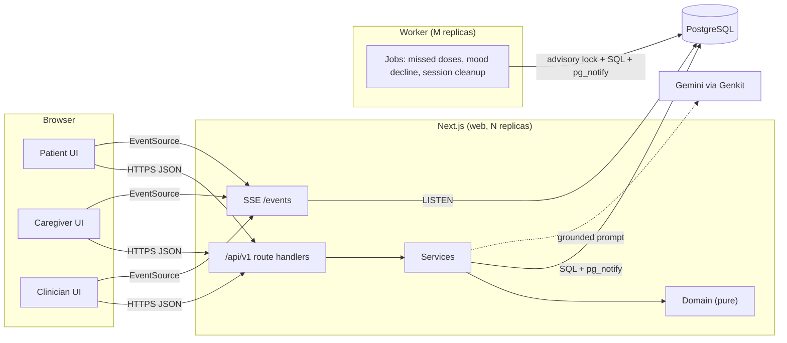
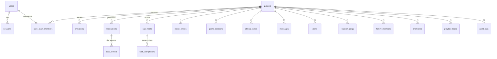

# Architecture

## System overview



There are two deployable processes built from one codebase:

- **web**: serves pages and the REST API. It is stateless apart from one `LISTEN` connection per instance.
- **worker**: runs scheduled jobs. It is separate so that slow scans never compete with request latency, and so it can be scaled or paused on its own.

PostgreSQL is the only stateful dependency. It holds the data and also carries the event bus and the job locks, so the system runs on "just Postgres" until there's a real reason to add Redis or a queue.

## Layers

| Layer    | Responsibility                                                                                                                                      | Rules                                                                                                      |
| -------- | --------------------------------------------------------------------------------------------------------------------------------------------------- | ---------------------------------------------------------------------------------------------------------- |
| Routes   | `src/app/api/v1/**/route.ts`. Each file is a few lines: declare the schemas, call a service.                                                        | No business logic.                                                                                         |
| Pipeline | `server/http/handler.ts`. Request ID, session validation and renewal, CSRF origin check, rate limiting, Zod parsing, error mapping, access logging. | Written once and used by every endpoint.                                                                   |
| Services | `server/services/*`. Authorization, transactions, audit rows, event publication.                                                                    | Each takes an `Executor` (the DB or a transaction) so it can be composed and tested against real Postgres. |
| Domain   | `server/domain/*`. Scheduling, adherence, mood statistics, difficulty, geofencing, text matching, the companion fallback.                           | Pure functions, no I/O. Most of the unit tests target this layer.                                          |

## Request lifecycle

1. Middleware runs at the edge and redirects page requests that have no session cookie. This is only a fast path; it doesn't validate anything.
2. `handler()` validates the cookie against `sessions` using the SHA-256 of the token, and slides the expiry if the session is past half its lifetime.
3. The Zod schemas from `lib/contracts.ts` validate path params, query and body.
4. The service calls `requireAccess(actor, patientId, action)`. It looks up the actor's role on that patient's care team and checks it against `authz/policy.ts`.
5. The mutation, its audit row and its `pg_notify` all run in one transaction.
6. The response is `{ data }`. Errors become `{ error: { code, message, details, requestId } }` in exactly one place.

## Data model



Key constraints:

| Constraint                                                              | Why                                                                                                          |
| ----------------------------------------------------------------------- | ------------------------------------------------------------------------------------------------------------ |
| `dose_events (medication_id, scheduled_for)` unique                     | Recording a dose is idempotent; the worker and a user can't create duplicates.                               |
| `alerts (patient_id, dedupe_key) WHERE status = 'open'`, partial unique | At most one open alert per condition. Deduplication is guaranteed by the database, not by a read-then-write. |
| `task_completions (task_id, on_date)` primary key                       | Completion is per local calendar date.                                                                       |
| `users lower(email)` unique                                             | Emails are unique regardless of case.                                                                        |
| `CHECK` on mood score, game score ≤ max, geofence radius                | Bad data is rejected at the lowest layer.                                                                    |

Medications and tasks store **local wall-clock times** plus the patient's IANA timezone. Doses are stored as **UTC instants**. `domain/schedule.ts` is the only place that converts between the two.

## Authorization

Permissions attach to the relationship (user × patient), not to the account:

| Action                       | Patient | Caregiver | Clinician |
| ---------------------------- | :-----: | :-------: | :-------: |
| Record doses, complete tasks |    ✓    |     ✓     |           |
| Edit medications             |         |     ✓     |     ✓     |
| Read clinical notes          |         |     ✓     |     ✓     |
| Write clinical notes         |         |           |     ✓     |
| Read location                |         |     ✓     |     ✓     |
| Acknowledge alerts           |         |     ✓     |     ✓     |
| Invite caregiver             |    ✓    |     ✓     |           |
| Invite clinician             |         |     ✓     |     ✓     |

The complete matrix is in `authz/policy.ts`, and every row has a test. Non-members get `404` rather than `403`.

## Realtime

```mermaid
sequenceDiagram
  participant Pt as Patient browser
  participant W1 as Web instance 1
  participant PG as Postgres
  participant W2 as Web instance 2
  participant Cg as Caregiver browser
  Cg->>W2: GET /events (SSE)
  W2->>PG: LISTEN neuro_patient_events (once per instance)
  Pt->>W1: POST /messages
  W1->>PG: BEGIN; INSERT message; pg_notify(...); COMMIT
  PG-->>W2: notification {patientId, type: message.created}
  W2-->>Cg: event: message.created
  Cg->>W2: GET /messages (TanStack Query invalidation)
```

Payloads carry IDs only. Clients refetch through the normal, authorised API, so an event can never leak data to someone who shouldn't see it, and the 8 kB `NOTIFY` limit never comes into play.

## Background jobs

`jobs/runner.ts` runs each job inside a transaction that first takes `pg_try_advisory_xact_lock(hash(jobName))`. If another replica holds the lock, the tick is skipped. The lock is released on commit or rollback, including if the process crashes. Each job's writes, alerts and notifications commit together. Every run is recorded in `job_runs`, and `/api/health` reports those rows, so a stalled worker is visible.

| Job                 | Interval | What it does                                                                                                                |
| ------------------- | -------- | --------------------------------------------------------------------------------------------------------------------------- |
| `missed-dose-sweep` | 5 min    | Expands the last 24 h of schedules, marks unrecorded doses past the grace window as `missed`, and raises one alert per dose |
| `mood-decline-scan` | 1 h      | Runs `detectDecline` per patient and raises at most one alert per patient per week                                          |
| `session-cleanup`   | 6 h      | Deletes expired sessions                                                                                                    |

## AI

- **Companion.** `services/assistant.ts` gathers today's doses, the plan, family and care team into a compact JSON. The prompt tells the model to answer only from those facts. On any failure (no key, timeout or schema mismatch), `domain/companion.ts` answers the common intents deterministically from the same facts. Distress phrases bring up a "Call for help" button.
- **Medicine check.** The client downscales the photo to 1024 px. Gemini reads the name, strength and expiry, then Levenshtein matching against the active prescriptions produces the verdict the patient sees.
- **Game difficulty.** No LLM is involved; see [ADR-005](adr/005-deterministic-difficulty.md).

## Testing strategy

| Level       | Tooling                | Focus                                                                             |
| ----------- | ---------------------- | --------------------------------------------------------------------------------- |
| Unit        | Vitest                 | Domain algorithms, policy matrix, rate limiter, contracts                         |
| Integration | Vitest + real Postgres | Services and HTTP handlers: SQL, constraints, concurrency, transactions, `NOTIFY` |
| E2E         | Playwright             | Role routing, cross-user realtime, clinician → caregiver hand-off                 |

The integration tests use a real database on purpose. Most of the correctness here lives in constraints, locks and transactions, which mocks can't exercise.
